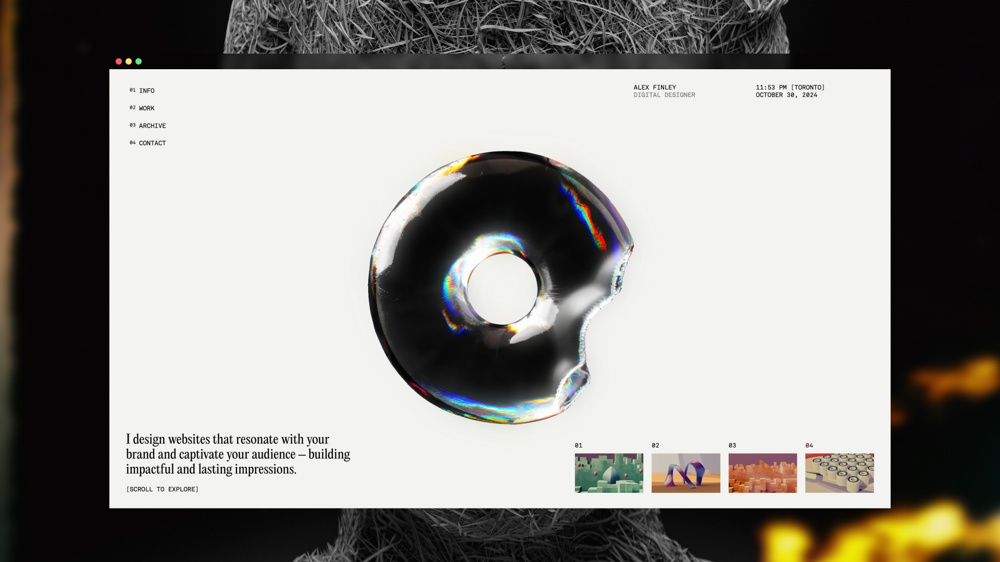

# Alex Finley - Digital Designer Portfolio



## 🌐 Live Demo
**[View Live Site](website-template-10.vercel.app/ )**

## 📖 Overview
A stunning and modern portfolio website for Alex Finley, a digital designer and creative developer. This project showcases a beautiful blend of typography, animations, and interactive elements to create an engaging user experience.

## ✨ Features

### 🎨 Design & Typography
- **Custom PP Editorial New Font Family** - Professional typography with multiple weights
- **Clean, Modern Layout** - Minimalist design with focus on content
- **Responsive Design** - Optimized for all devices and screen sizes
- **Dark/Light Theme Elements** - Dynamic color schemes

### 🚀 Interactive Elements
- **3D Canvas Integration** - Interactive 3D elements using Spline
- **Smooth Scrolling** - Powered by Lenis for buttery-smooth navigation
- **GSAP Animations** - Professional animations and transitions
- **Dynamic Navigation** - Smart navigation with progress indicators
- **Project Carousel** - Interactive project showcase

### 🛠️ Technical Features
- **Modern Vanilla JavaScript** - Clean, performant code
- **CSS Grid & Flexbox** - Advanced layout techniques
- **Optimized Performance** - Fast loading and smooth interactions
- **Cross-browser Compatible** - Works on all modern browsers
- **No Horizontal Scroll Issues** - Perfectly contained layout

## 🎯 Sections

### 📝 Portfolio Sections
- **Hero Section** - Eye-catching introduction with 3D elements
- **About** - Designer introduction and philosophy
- **Services** - Web Design, Webflow Development, Animation & Art Direction
- **Work Portfolio** - Featured projects with detailed views
- **Archive** - Complete project history
- **Contact** - Professional contact information

### 📊 Services Offered
1. **Web Design** - Visually engaging and functional websites
2. **Webflow Development** - Professional Webflow implementation
3. **Animation & Interaction** - Modern animations and user interactions
4. **Art Direction** - AI-driven visual creation and creative direction

## 🚀 Quick Start

### Prerequisites
- Modern web browser
- No build tools required - pure HTML/CSS/JS

### Installation
1. Clone the repository
```bash
git clone https://github.com/Alexey9911/website-template-10.git
cd website-template-10
```

2. Open `index.html` in your browser
```bash
# Simply open index.html with your preferred browser
```

### Development
For live development with live reload:
```bash
# Use any static server, for example:
npx serve .
# or
python -m http.server 8000
```

## 📁 Project Structure
```
alex-finley/
├── index.html              # Main page
├── project.html            # Project detail page
├── css/
│   ├── fonts.css           # Custom font declarations
│   ├── globals.css         # Global styles
│   ├── transition.css      # Page transitions
│   └── home/               # Home page specific styles
│       ├── hero.css
│       ├── services.css
│       ├── carousel.css
│       ├── archive.css
│       └── footer.css
├── js/
│   ├── home.js            # Main interactions
│   ├── project.js         # Project page logic
│   └── transition.js      # Page transitions
├── fonts/                 # Custom PP Editorial New fonts
├── assets/                # Images and media
└── content/
    └── data.js           # Dynamic content data
```

## 🎨 Customization

### Colors
Edit the CSS custom properties in `css/globals.css`:
```css
:root {
  --bg: #f3f3f0;
  --bg-dark: #191b20;
  --text: #000;
  --text-light: #f3f4ee;
  --accent: #ab9cea;
}
```

### Content
Update project data in `content/data.js`:
- Services information
- Portfolio projects
- Archive items
- Contact details

### Fonts
The project uses PP Editorial New font family. Fonts are included in the `/fonts` directory.

## 📱 Responsive Breakpoints
- **Desktop**: > 900px
- **Mobile**: ≤ 900px
- Fully responsive design adapts to all screen sizes

## 🌟 Key Technologies
- **HTML5** - Semantic markup
- **CSS3** - Modern styling with custom properties
- **Vanilla JavaScript** - Clean, performant interactions
- **GSAP** - Professional animations
- **Lenis** - Smooth scrolling
- **Spline** - 3D graphics integration

## 🔧 Browser Support
- Chrome 60+
- Firefox 60+
- Safari 12+
- Edge 79+

## 📈 Performance
- Fast loading times
- Optimized images and assets
- Smooth animations at 60fps
- Mobile-optimized performance

## 🚀 Deployment

### Vercel (Recommended)
This project is deployed on Vercel:
```bash
vercel --prod
```

### Other Platforms
Works with any static hosting:
- Netlify
- GitHub Pages
- Surge.sh
- Firebase Hosting

## 🤝 Contributing
1. Fork the project
2. Create your feature branch (`git checkout -b feature/AmazingFeature`)
3. Commit your changes (`git commit -m 'Add some AmazingFeature'`)
4. Push to the branch (`git push origin feature/AmazingFeature`)
5. Open a Pull Request

## 📄 License
This project is licensed under the MIT License - see the [LICENSE](LICENSE) file for details.

## 👤 Author
**Alex Finley** - Digital Designer & Creative Developer
- Portfolio: [Live Demo](https://website-template-10-dz6dfh4qk-alexey9911s-projects.vercel.app)
- Email: hello@alexfinley.com

## 🙏 Acknowledgments
- PP Editorial New Font Family
- GSAP Animation Library
- Lenis Smooth Scrolling
- Spline 3D Graphics
- Modern web development practices

---

⭐ **If you found this project helpful, please give it a star!**
